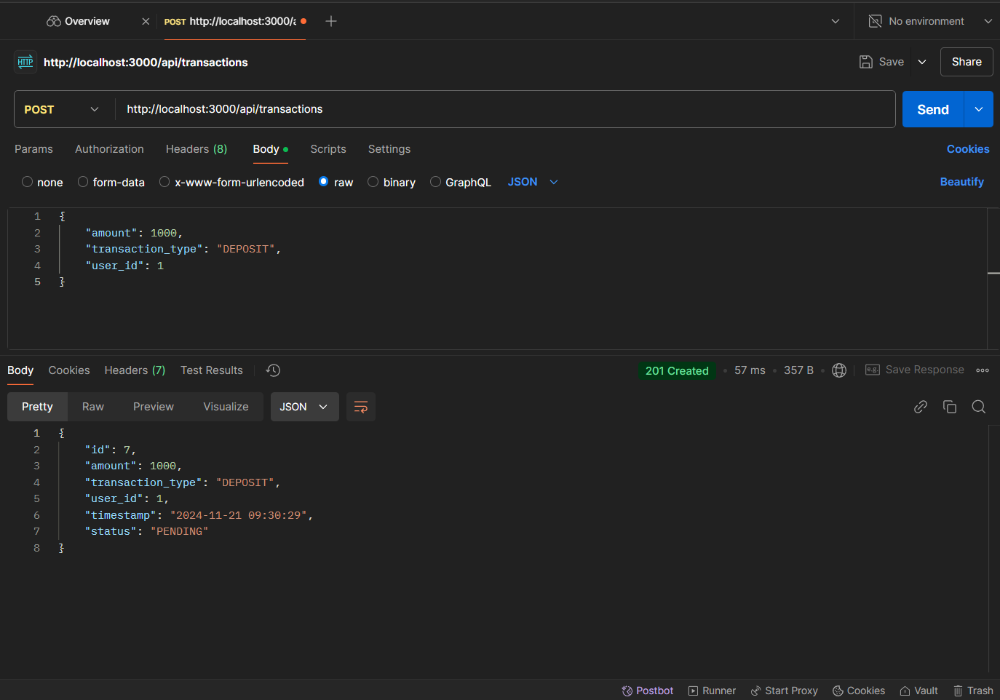
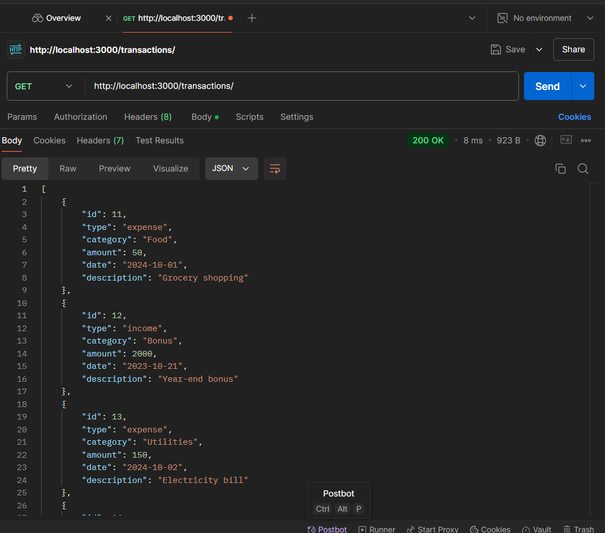
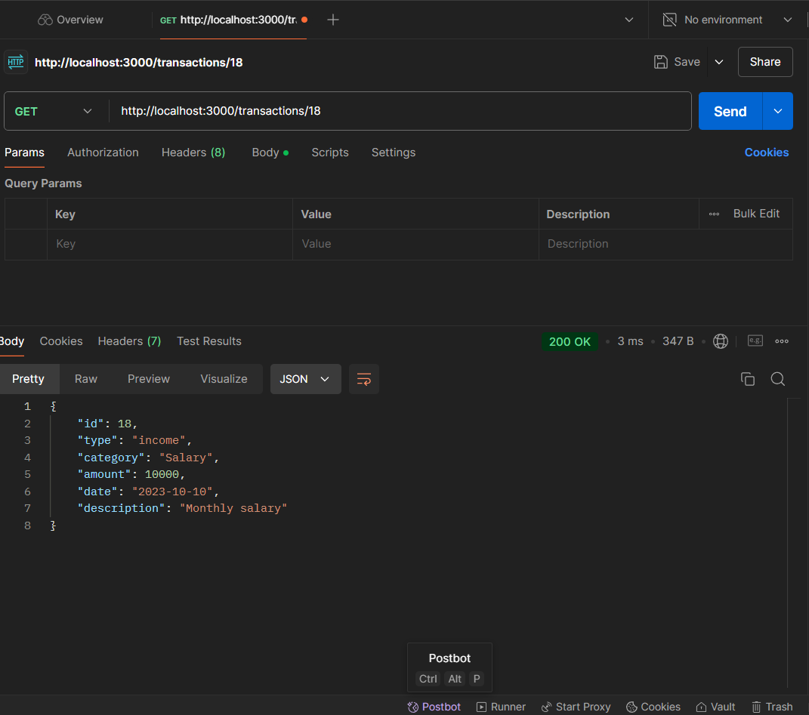
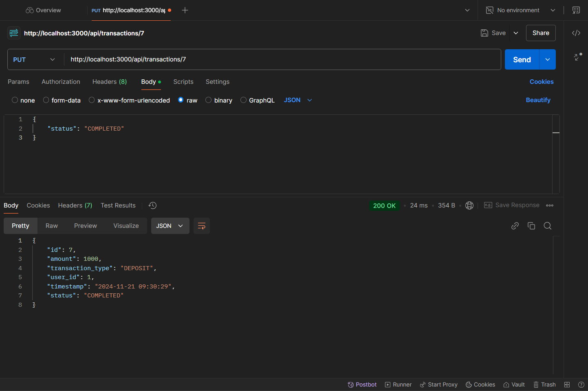
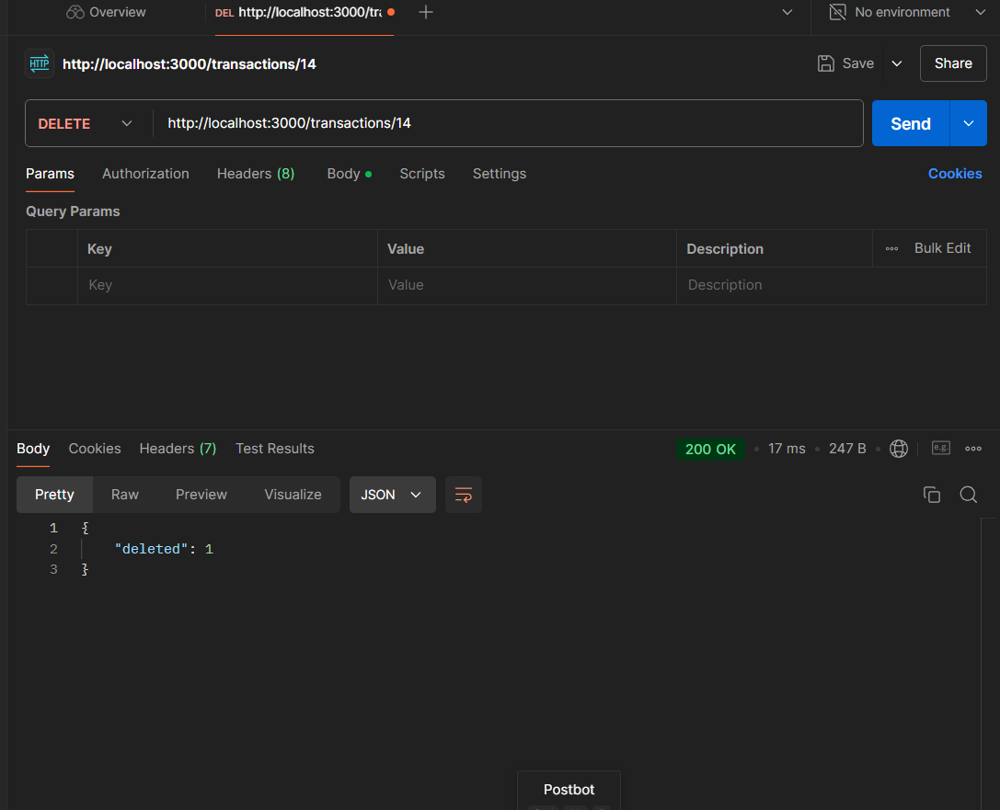
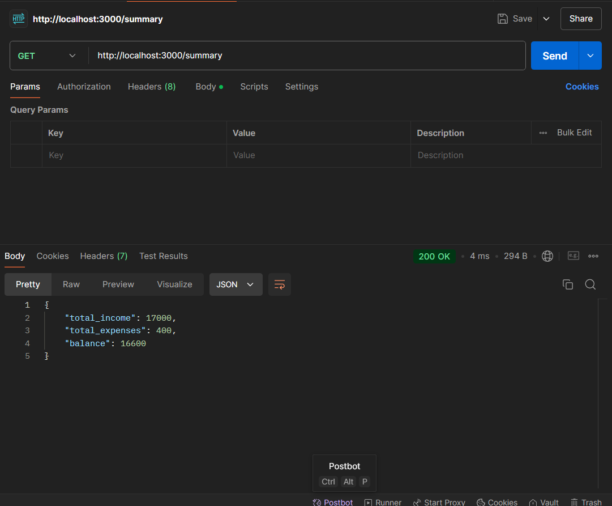

# Personal Expense Tracker API

## Setup and Run Instructions

1. Clone the repository:
    ```bash
    git clone <repository-url>
    cd <repository-folder>
    ```

2. Install dependencies:
    ```bash
    npm install
    ```

3. Run the server:
    ```bash
    node app.js
    ```

4. API will be available at `http://localhost:3000`

## API Documentation

### Transactions

- **POST /transactions**
  - Request Body:
    ```json
    {
        "type": "income", // or "expense"
        "category": "Salary",
        "amount": 5000,
        "date": "2023-10-20",
        "description": "Monthly salary"
    }
    ```

- **GET /transactions**
  - Response:
    ```json
    [
        {
            "id": 1,
            "type": "income",
            "category": "Salary",
            "amount": 5000,
            "date": "2023-10-20",
            "description": "Monthly salary"
        },
        ...
    ]
    ```

- **GET /transactions/:id**
  - Response:
    ```json
    {
        "id": 1,
        "type": "income",
        "category": "Salary",
        "amount": 5000,
        "date": "2023-10-20",
        "description": "Monthly salary"
    }
    ```

- **PUT /transactions/:id**
  - Request Body:
    ```json
    {
        "type": "income",
        "category": "Bonus",
        "amount": 2000,
        "date": "2023-10-21",
        "description": "Year-end bonus"
    }
    ```

- **DELETE /transactions/:id**
  - Response:
    ```json
    {
        "deleted": 1
    }
    ```

### Summary

- **GET /summary**
  - Response:
    ```json
    {
        "total_income": 5000,
        "total_expenses": 2000,
        "balance": 3000
    }
    ```


## API Call Screenshots


### 2. Post Transaction


### 1. Get All Transactions


### 3. Get Transaction by ID


### 4. Update Transaction


### 5. Delete Transaction


### 6. Get Summary

